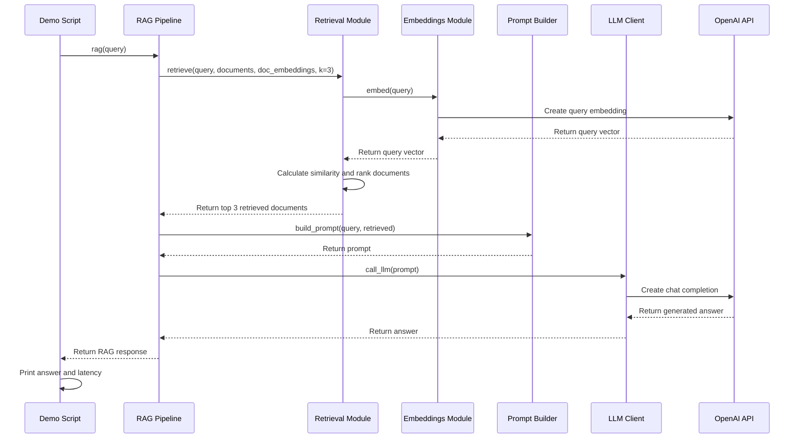

# RAG-python

## Project overview

This repository contains a small, educational retrieval-augmented generation (RAG) implementation for a financial research assistant. The goal is to demonstrate the core mechanics of a simple RAG workflow in Python rather than build a production-ready system.

The project shows how the application:

- loads a small synthetic financial corpus
- creates embeddings for the documents
- retrieves the most relevant passages for a user query
- builds a prompt and generates an investment-style summary with an LLM

This is intended as a baseline for learning and comparison with other RAG frameworks.

## RAG sequence

The demo follows this retrieval-augmented generation flow:



## Installation

This project uses Python 3.13+ and the package manager uv.

1. Install uv if it is not already available.
2. From the repository root, install dependencies:

   ```bash
   uv sync
   ```

3. Create a `.env` file in the project root and add your OpenAI API key:

   ```bash
   OPENAI_API_KEY=your-api-key-here
   ```

## Running the demo

Run the sample RAG workflow from the project root:

```bash
uv run python scripts/run.py
```

This will execute a sample financial research query and print the generated answer along with the total runtime.
